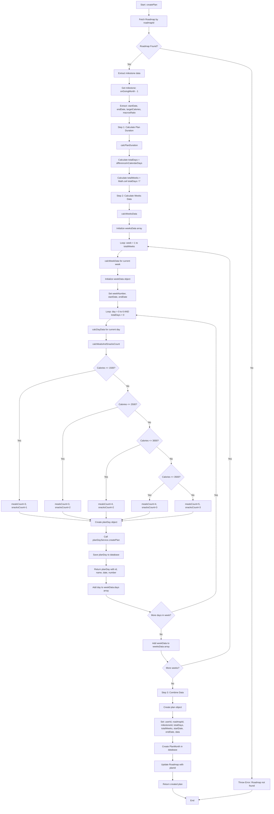

# Plan Month Creation Flow Chart

This flow chart illustrates the complete process of creating a monthly meal plan.

## Key Components

### 1. Plan Duration Calculation

- Calculates total days between start and end dates
- Determines total weeks needed (rounded up)

### 2. Weeks Data Generation

- Creates week templates for the entire plan duration
- Each week contains 7 days (or remaining days for the last week)

### 3. Day Data Creation

- For each day, calculates meals and snacks count based on calories
- Creates individual PlanDay documents in the database
- Returns day metadata (id, name, date, number)

### 4. Data Combination

- Combines all calculated data into a PlanMonth object
- Saves the plan to the database
- Updates the roadmap with the new plan ID

## Meal/Snack Count Logic

| Calories Range | Meals Count | Snacks Count |
| -------------- | ----------- | ------------ |
| ≤ 1500         | 3           | 1            |
| 1501-2500      | 3           | 2            |
| 2501-3000      | 4           | 2            |
| 3001-3500      | 4           | 3            |
| > 3500         | 5           | 3            |
